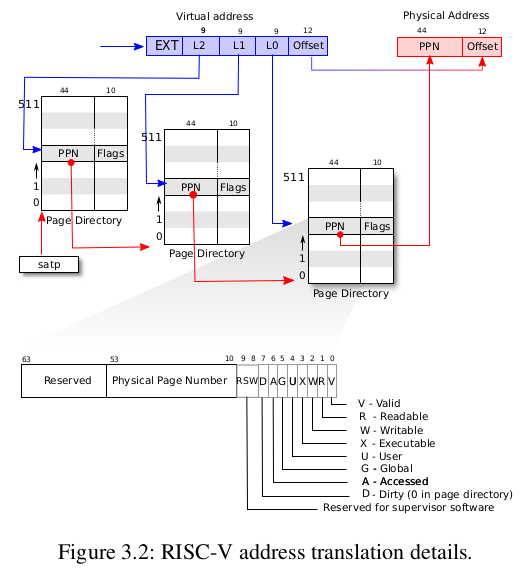
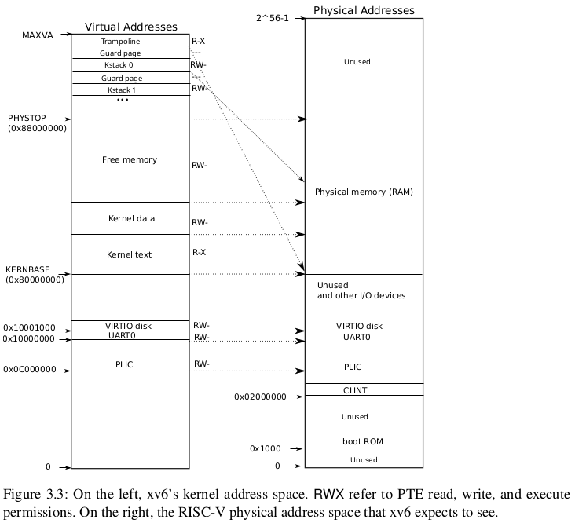
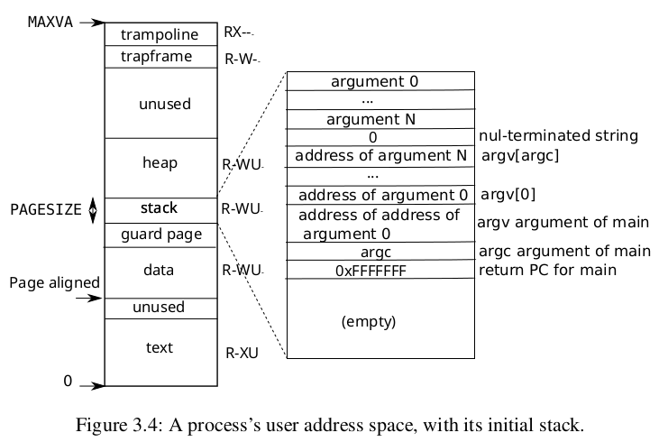

# 每一个lab处在相关的分支中
# xv6 os

介绍xv6操作系统

# 第一章用户程序

```shell
1.riscv64-unknown-elf-gcc -Wall -Werror -O -fno-omit-frame-pointer -ggdb -gdwarf-2 -DSOL_UTIL -DLAB_UTIL -MD -mcmodel=medany -ffreestanding -fno-common -nostdlib -mno-relax -I. -fno-stack-protector -fno-pie -no-pie -march=rv64g -nostdinc -I. -Ikernel -c user/initcode.S -o user/initcode.o
2.riscv64-unknown-elf-ld -z max-page-size=4096 -N -e start -Ttext 0 -o user/initcode.out user/initcode.o
3.riscv64-unknown-elf-objcopy -S -O binary user/initcode.out user/initcode
```

从用户的角度进行查看以initcode.S程序为例，每一个用户程序都至少需要经历上面两个步骤。

1. 将源代码编译成目标文件。
1. ld链接成ELF文件的过程，xv6的用户链接脚本是从0虚拟地址开始的。
1. 对于第一个用户程序initcode.S特有的命令直接获取执行的指令，放到proc.c文件中。

第一章需要调用user.h中的system calls来实现各种用户程序。

# 第二章syscall

添加syscall系统调用，获取操作系统的资源查看系统的状态。

记录下从用户层面的syscall的流程
1. 当执行指令ecall之后，pc会跳转到stvec陷入指令的位置，其中pc的值会保存到epc，程序跳转到uservec
1. 然后程序会跳转到usertrap() ---> syscall(). ----> 会根据ecall指令之前设置a7寄存器的值来调用相关的系统调用
1. 完成syscall之后usertrapret(). --->. userret() ---->继续用户程序的执行

# 第三章 

下面是一些默认的要求，那么可以分析的是在默认的要求下，用户的地址空间是2^39，物理内存的范围是2^56

```c
#define SATP_SV39 (8L << 60)
#define MAKE_SATP(pagetable) (SATP_SV39 | (((uint64)pagetable) >> 12))
```

上面代表的是写入寄存器的值，之后就是默认打开虚拟地址映射了。在不同的进程中satp寄存器的值也是不一样的。首先就是根据satp寄存器的值获取页目录的地址，然后根据虚拟地址的9位获取页表项的位置，其中的页表项包含PPN(physical page number)当前物理内存中第几个页表。以及flags代表着当前页表项PPN的物理内存的访问权限。然后根据该页表项找到一级页表地址，同理不断的查找，直到真正的物理地址。注意在xv6中页目录和一级页表的flags都是PTE_V仅仅是有效的，二级页表的flags对应的是真正物理内存的访问权限。



下面对应的内核虚拟地址空间，主要就是`trampoline`的映射，一级每一个用户的内核栈的初始化映射。




下面的图片介绍了用户进程的虚拟地址空间，其中text、data是由链接脚本进行定义的，之后会分配两个页面一个是保障页面(其中设置了用户进程是不可以访问的，用于防止栈溢出操作)，另一个页面是stack，其中sp寄存器从高地址向低地址进行增长的过程，需要在用户中初始化相关的参数。然后是heap进行用户进程的扩充操作，对应与proc->sz。最后的两个页面`trampoline`页面代表的是用户陷入和陷出一段指令(页面的flag是PTE_R|PTE_X)没有PTE_U，因为在ecall之后就是kernel模式了，所以可以访问执行该页面，`trapframe`代表的是每一个进程保存用户上下文寄存器的页面(flag是PTE_R | PTE_W)也没有PTE_U，保存上下文操作是在kernel模式下。


